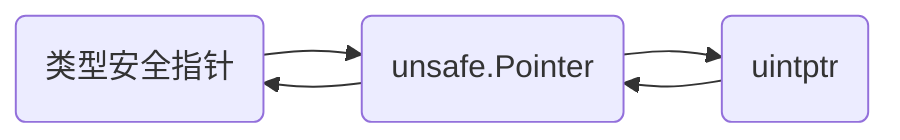

# Go 的三种指针

在 Go 语言中，存在着三种指针：类型安全指针、unsafe.Pointer 和 uintptr 。在日常开发中，经常使用的就是类型安全指针。但是在一些特殊场景下，需要用到其他两种指针才能实现需求。

三种指针间可以进行相互转换，其转换关系为：



## 一、类型安全指针

类型安全指针是在日常开发中最常使用的指针。类型安全指针用法与 C 语言中的类似，但是在 Go 中的类型安全指针没法像 C 语言那样对指针进行算术操作，只能进行取值和取地址、类型转换和比较。

取值和取地址：

```go
func main() {
    p1 := new(int)   // 创建一个 *int 类型的指针
    fmt.Println(p1)  // 输出十六进制的地址
    fmt.Println(*p1) // 输出 0
}
```

类型转换和比较：

**当两个指针类型变量的底层类型一致时，才能进行比较和显示转换**。

```go
type MyInt int
type PInt *int
type PMyInt *MyInt

func main() {
    p1 := new(int)        // p1 类型为 *int
	var p2 IntB = p1      // p2底层类型是*int
	fmt.Println(p1 == p2) // out: true

	p3 := new(IntA)       // p3 类型为 *IntA
	var p4 IntC = p3      // p4 底层类型是 *IntA
	fmt.Println(p3 == p4) // out: true

	//fmt.Println(p1 == p3)  // invalid operation: p1 == p3 (mismatched types *int and *IntA)
}
```

## 二、unsafe.Pointer

`unsafe.Pointer` 是由 `unsafe` 包提供的类型，它被称为**非安全指针类型**。

```go
// ArbitraryType is here for the purposes of documentation only and is not actually
// part of the unsafe package. It represents the type of an arbitrary Go expression.
type ArbitraryType int

// Pointer represents a pointer to an arbitrary type.
type Pointer *ArbitraryType
```

在 `unsafe` 包中同时也提供了以下五种函数:

```go
func Sizeof(x ArbitraryType) uintptr

func Offsetof(x ArbitraryType) uintptr

func Alignof(x ArbitraryType) uintptr

// 以下两个函数从 go1.17 开始提供
func Add(ptr Pointer, len IntegerType) Pointer

func Slice(ptr *ArbitraryType, len IntegerType) []ArbitraryType
```

**Sizeof(x ArbitraryType)**：该函数用来获取一个值的类型的大小（等同于 C 语言的 `sizeof`）。在同样的编译环境下，同一类型的不同值获取到的类型大小相同。

```go
func main() {
    fmt.Println(unsafe.Sizeof(int(1)))   // 8
	fmt.Println(unsafe.Sizeof(byte(1)))  // 1
	fmt.Println(unsafe.Sizeof(int64(1))) // 8
	fmt.Println(unsafe.Sizeof(int32(1))) // 4

	/*
		在 src/runtime/string.go 中可以发现字符串的结构体实现
		type stringStruct struct {
			str unsafe.Pointer  // 8
			len int             // 8
		}
	*/
	fmt.Println(unsafe.Sizeof("123")) // 16
	fmt.Println(unsafe.Sizeof(""))    // 16

	/*
		在 src/runtime/slice.go 中可以发现字符串的结构体实现
		type slice struct {
			array unsafe.Pointer    // 8
			len   int               // 8
			cap   int               // 8
		}
	*/
	fmt.Println(unsafe.Sizeof([]byte{}))        // 24
	fmt.Println(unsafe.Sizeof([]byte{1, 2, 3})) // 24
    
	fmt.Println(unsafe.Sizeof([2]byte{1, 2}))   // 2
	fmt.Println(unsafe.Sizeof([3]byte{1, 2}))   // 3

	fmt.Println(unsafe.Sizeof(uintptr(1)))                   // 8
	fmt.Println(unsafe.Sizeof(map[string]string{"1": "1"}))  // 8
	fmt.Println(unsafe.Sizeof(map[string]struct{}{"1": {}})) // 8
	fmt.Println(unsafe.Sizeof(make(chan error, 1)))          // 8
}
```

**Alignof(x ArbitraryType)**：该函数会返回一个类型的对齐值，也可以叫做对齐系数或者对齐倍数。

```go
func main() {
	var (
		b   bool
		i8  int8
		i16 int16
		i64 int64
		f32 float32
		s   string
		p   *int
	)

	fmt.Println(unsafe.Alignof(b))   // 1
	fmt.Println(unsafe.Alignof(i8))  // 1
	fmt.Println(unsafe.Alignof(i16)) // 2
	fmt.Println(unsafe.Alignof(i64)) // 8
	fmt.Println(unsafe.Alignof(f32)) // 4
	fmt.Println(unsafe.Alignof(s))   // 8
	fmt.Println(unsafe.Alignof(p))   // 8
}
```

**Offsetof(x ArbitraryType)**：该函数用来获取一个结构体某个字段相对于次结构体的地址偏移量。

```go
type User struct {
	Name string
	Age  int
	Sex  byte
}

func main() {
	u := User{
		Name: "Lynx",
		Age:  18,
		Sex:  1,
	}

	fmt.Println(unsafe.Offsetof(u.Name)) // 0
	fmt.Println(unsafe.Offsetof(u.Age))  // 16
	fmt.Println(unsafe.Offsetof(u.Sex))  // 24
	fmt.Println(unsafe.Sizeof(u))        // 32
}
```

**Add(ptr Pointer, len IntegerType)**：此函数在一个非安全指针表示的地址上添加一个偏移量，然后返回表示新地址的一个指针。

**Slice(ptr *ArbitraryType, len IntegerType)**：此函数从一个任意（安全）指针派生出一个指定长度的切片。

## 三、uintptr

`uintptr` 是一个整数类型，能够存放任意指针。`uintptr` 可以像 C 语言里面的指针一样进行运算操作。但是 Go 里面的类型安全指针不能直接转换成 `uintptr` 指针，必须先转换成 `unsafe.Pointer` 类型，再转换成 `uintptr`。

```go
// uintptr is an integer type that is large enough to hold the bit pattern of any pointer.
type uintptr uintptr
```

## 四、正确使用 unsafe.Pointer 

在 `unsafe` 包中列举了六种 `unsafe.Pointer` 的场景，如果不是以下使用场景，我们在使用 `unsafe.Pointer` 时可能会无效。

> // Code not using these patterns is likely to be invalid today or to become invalid in the future.
>
> // Even the valid patterns below come with important caveats.


### 1. 类型转换

```go
func Float64bits(f float64) uint64 {
   return *(*uint64)(unsafe.Pointer(&f))
}
```

在转换过程中，`unsafe.Pointer`充当桥梁，将 `float64` 类型转换为 `uint64`。 注意目标类型的尺寸不应该大于原始类型，否则会出现溢出异常。

### 2. Pointer 转换为 uintptr（不逆转换）

将 `unsafe.Pointer` 转换为 `uintptr` 类型，这种转换一般只用于打映内存地址。由于 GC 的存在，将 `uintptr` 转换回 `unsafe.Pointer` 的操作可能是无效操作（对象被 GC 回收）。

获得到的 `uintptr` 只是一个没有指针语义得整数值。当对象地址发生变更时，获得到的 `uintptr` 不会发生变化。

```go
func main() {
   a := 10
   fmt.Printf("%p\n", &a)
   fmt.Printf("%d\n", uintptr(unsafe.Pointer(&a)))
}
```

### 3. 指针运算

我们可以对 `uintptr` 做运算操作，从而获取到其他地址的值。这种模式常用来访问结构体字段或者数组的地址。

```go
type MyType struct {
	f1 uint8
	f2 int
	f3 uint64
}

func main() {
	fmt.Println("结构体: ")
	s := MyType{f1: 10, f2: 20, f3: 30}
	fmt.Println("f1 地址：", uintptr(unsafe.Pointer(&s)))
	fmt.Println("f1 值：", *(*uint8)(unsafe.Pointer(&s)))
	fmt.Println("f2 地址：", uintptr(unsafe.Pointer(&s))+unsafe.Offsetof(s.f2))
	fmt.Println("f2 值：", *(*int)(unsafe.Pointer(uintptr(unsafe.Pointer(&s)) + unsafe.Offsetof(s.f2))))
	fmt.Println("f3 地址：", uintptr(unsafe.Pointer(&s))+unsafe.Offsetof(s.f3))
	fmt.Println("f3 值：", *(*int)(unsafe.Pointer(uintptr(unsafe.Pointer(&s)) + unsafe.Offsetof(s.f3))))

	// 上面这种进对 uintptr 进行运算的操作，在 go1.17后的版本推介使用 unsafe.Add()
	fmt.Println("f3 地址：", uintptr(unsafe.Add(unsafe.Pointer(&s), unsafe.Offsetof(s.f3))))

	fmt.Println("\n数组: ")
	arr := [3]int{11, 22, 33}
	fmt.Printf("%p\n", &arr)
	for i := 0; i < 3; i++ {
		fmt.Printf("arr[%d] addr: %x\n", i, uintptr(unsafe.Pointer(&arr[0]))+uintptr(i)*unsafe.Sizeof(arr[0]))
		fmt.Printf("arr[%d] value: %d\n", i, *(*int)(unsafe.Pointer(uintptr(unsafe.Pointer(&arr[0])) + uintptr(i)*unsafe.Sizeof(arr[0]))))
	}
}
```

**:exclamation::exclamation::exclamation:注意**：

在进行上面的指针计算时，不能将获得的地址赋值给临时变量。如下面这种用法就是有问题的：

```go
f2Addr := uintptr(unsafe.Pointer(&s))+unsafe.Offsetof(s.f2)
... other code
fmt.Println(*(*int)(unsafe.Pointer(f2Addr)))
```

在执行 other code 的过程中，变量 s 可能会因为不被其他任何变量引用，导致被 GC 回收了内存空间。因此在将 f2Addr 转换为 `unsafe.Pointer` 的时候就会爆出**非法指针**的错误。

因此，我们在涉及到指针的转换时，需要在一行代码内完成指针转换，因为编译器会保证当前行代码的转换是有效的。

同样的，我们也不能够将获得的 `uintptr` 作为函数变量传递给其他函数（除了下面这种模式）。

### 4. 系统调用

在上面的介绍中，我们知道将 `uintptr` 作为变量传递给一个普通函数是一种非法的行为。

但是，将 `uintptr` 变量传递给 `syscall.Syscall` 这样的函数是安全的，其他自定义的函数无法享受到这样的特权。**这是编译器进行的安全保证**。

### 5. 将 reflect.Value.Pointer/UnsafeAddr 方法的 uintptr 返回值转换为非类型 安全指针

`reflect`标准库中`Value`类型的`Pointer`和`UnsafeAddr`方法都返回一个`uintptr`值，而不是一个`unsafe.Pointer`值。 

Go 团队这样设计的初衷是避免用户不引用`unsafe`标准库包就可以将这两个方法的返回值转换为任何类型安全指针类型。

但是由于返回的值是 `uintptr` 类型的，因此必须在返回的时候就立即将其转换为非类型安全的指针，否则就有可能因为 GC 回收变量导致触发非法指针错误。

```go
// 安全
p := (*int)(unsafe.Pointer(reflect.ValueOf(new(int)).Pointer()))

// 不安全！！！
u := reflect.ValueOf(new(int)).Pointer()
// 在这个时刻，处于存储在 u 中的地址处的内存块可能会被回收掉。
p := (*int)(unsafe.Pointer(u))
```

不过在 go 1.18 版本后，`reflect.Value` 引入了一个新的方法: `func (v Value) UnsafePointer() unsafe.Pointer`，该方法返回一个 `unsafe.Pointer` 变量。官方推介使用这个方法来代替之前的 `Pointer` 和 `UnsafeAddr` 方法，用以解决原来设计思路的问题。

### 6. 将 reflect.SliceHeader 或 reflect.StringHeader 的 Data 字段转换成非安全类型，或反之操作

`SliceHeader` 和 `StringHeader` 分别是数字和字符串的实现结构体，由于两个结构体十分类似，可以利用他们实现字符串和 byte 数组零内存拷贝转换。

```go
func String2Bytes(s string) []byte {
	stringHeader := (*reflect.StringHeader)(unsafe.Pointer(&s))

    var b []byte
    pbytes := (*reflect.SliceHeader)(unsafe.Pointer(&b))
    pbytes.Data = stringHeader.Data
    pbytes.Len = stringHeader.Len
    pbytes.Cap = stringHeader.Len

    return b
}
```

