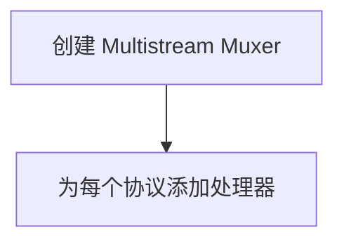
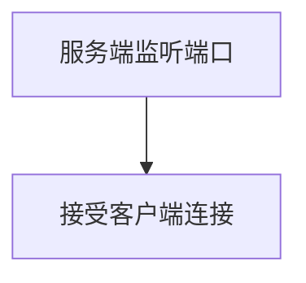
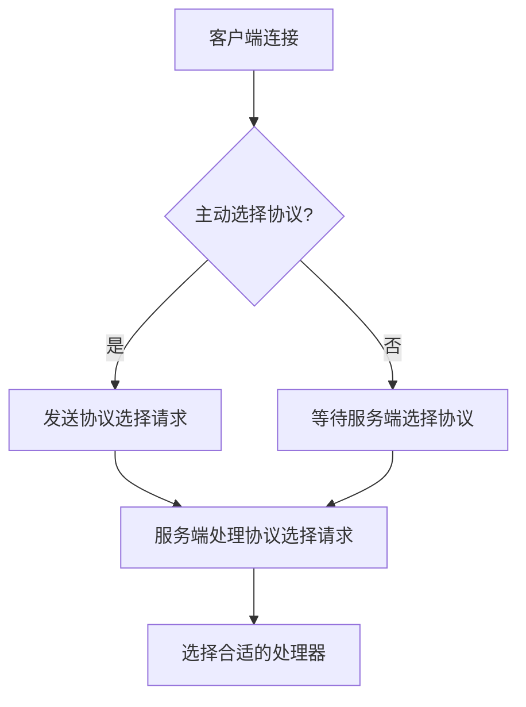
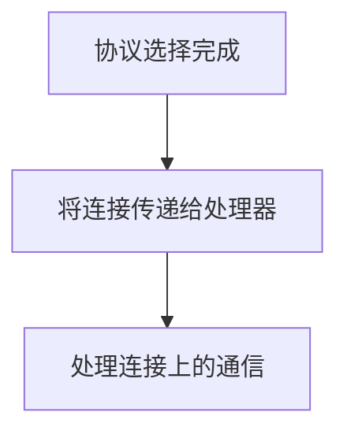
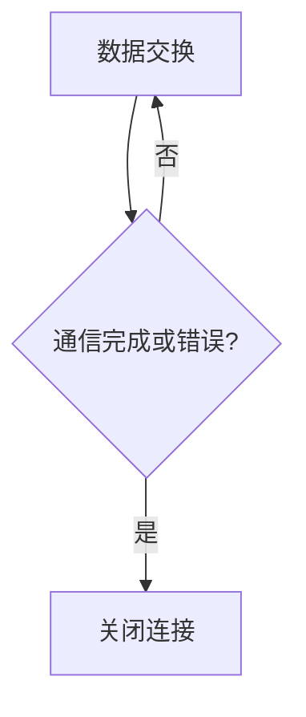
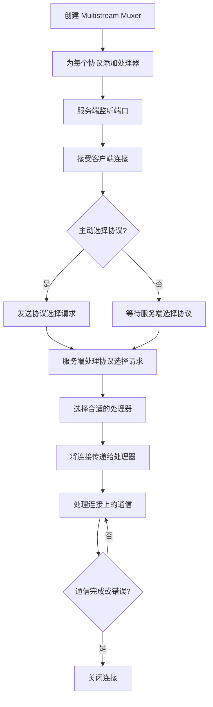

# Multistream-Select 流程分析

## 简介

[Multistream-Select](https://github.com/multiformats/multistream-select) 是一个协议选择机制，允许在单一连接上支持多种不同的协议通信。它提供了一种方式，让客户端和服务端在连接建立后选择使用哪种协议进行通信。`go-multistream` 是这个协议的一个 Go 语言实现，通过提供一个简单的流路由器（Stream Router），来管理和处理不同协议的选择和通信。

## 协议选择流程

### 1. **设置多流复用器（Muxer）**

首先，需要创建一个多流复用器（Muxer），它负责管理和路由不同协议的通信。Muxer 可以看作是一个接线员，负责将连接分配给正确的协议处理器。

**流程图：**

### 2. **监听和接受连接**

服务端需要监听一个特定的端口，等待客户端的连接请求。当有客户端连接时，Muxer 会接受这个连接。

**流程图：**

### 3. **协议选择**

- **主动选择**：客户端可以主动指定要使用的协议。这可以通过 `SelectProtoOrFail` 方法或创建一个 `MSSelect` 对象来实现。客户端会发送一个协议选择请求给服务端。

- **被动选择**：服务端可以根据客户端的请求来选择协议。Muxer 会根据预先设定的处理器来处理连接。

**流程图：**

### 4. **处理连接**

一旦协议选择完成，Muxer 会将连接传递给对应的协议处理器。处理器负责处理这个连接上的所有通信。

**流程图：**

### 5. **数据传输与关闭**

- **数据传输**：客户端和服务端通过选择的协议进行数据交换。
- **连接关闭**：当通信完成或出现错误时，连接会被关闭。

**流程图：**

### 完整流程图

## 理解流程

- **多流复用器**：可以想象成一个电话交换机，它接听来自客户端的电话（连接），并根据客户端的需求（协议选择）将电话转接给合适的接线员（处理器）。

- **协议选择**：就像是选择你要用什么语言与对方交流，客户端可以告诉服务端“我要用中文/英文/法语交流”，服务端则会根据这个选择来进行相应的处理。

- **处理连接**：一旦协议选择好，通信就按照这个协议进行。就像是双方开始用选定的语言交流。

- **数据传输与关闭**：就像是双方交流完毕后，挂断电话（关闭连接）。

通过这个流程，`go-multistream` 库让不同协议在同一连接上进行选择和通信变得简单易行，适用于需要灵活性和效率的网络应用场景。