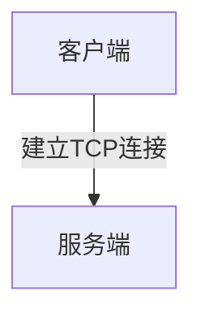
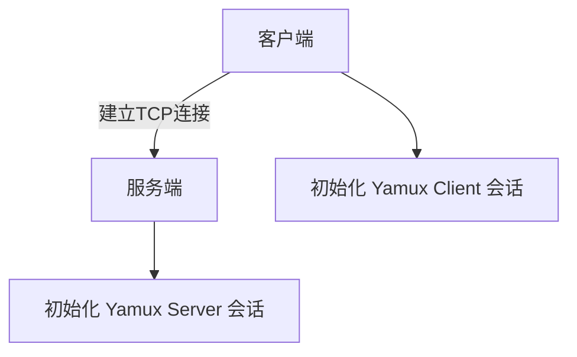
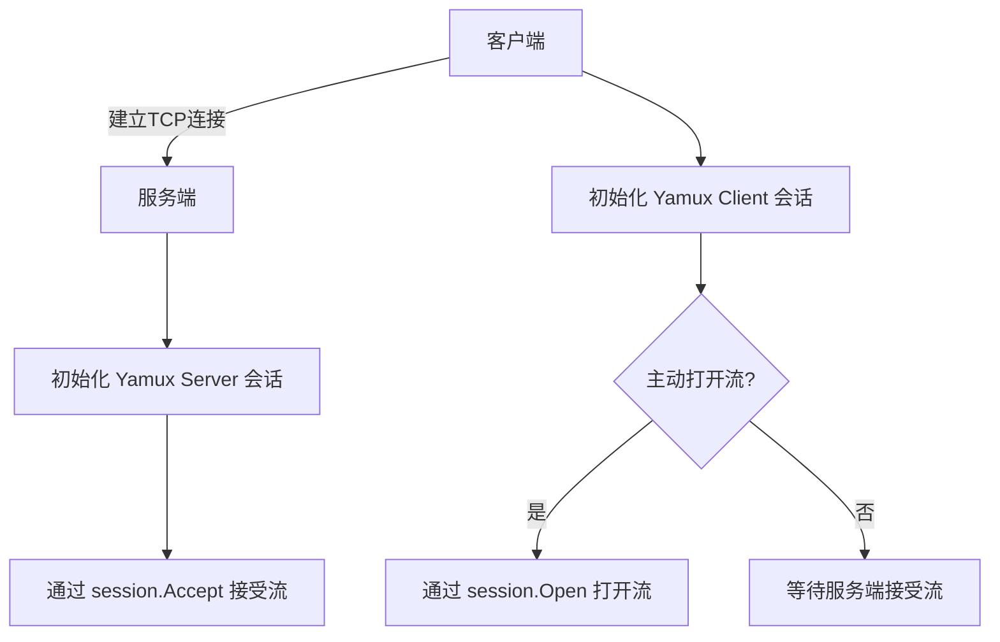
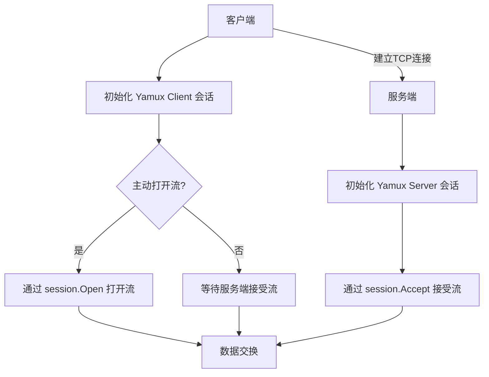
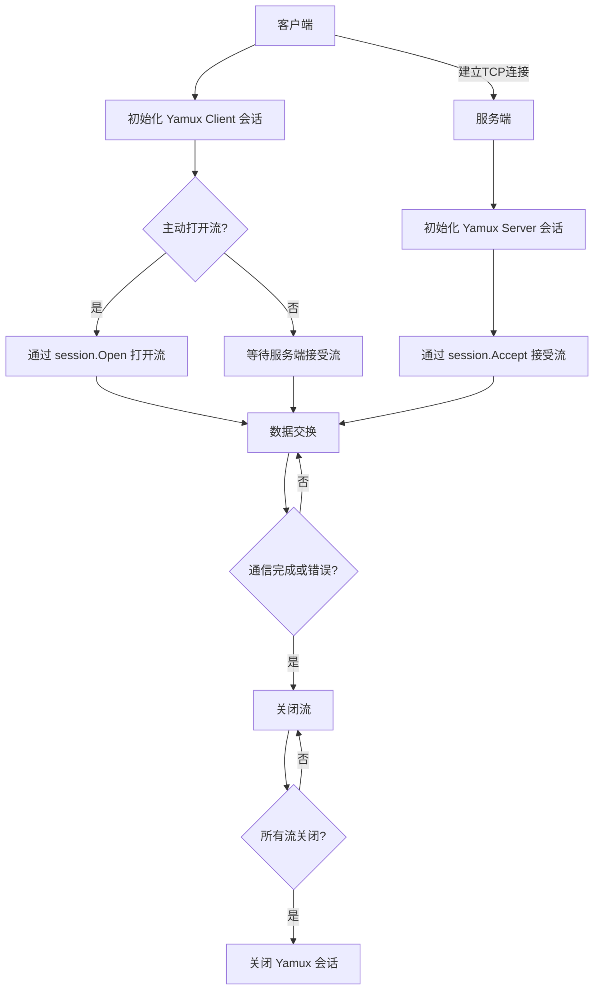

# Yamux 多路复用流程分析文档

## 简介

Yamux (Yet Another Multiplexer) 是一个 Golang 实现的多路复用库。它在底层连接（如 TCP 或 Unix 域套接字）之上提供流式多路复用功能，旨在优化网络资源利用率，提高连接效率和性能。它类似于 SPDY，但不与之兼容。Yamux 允许在一个单一的连接上同时传输多个逻辑流（Streams）。

## 多路复用流程

### 1. **连接建立**

首先，客户端和服务端通过底层连接（如 TCP）建立连接。这个连接提供可靠性和顺序性，是多路复用的基础。

**流程图：**

### 2. **Yamux Session 初始化**

- **客户端**：通过 `yamux.Client(conn, nil)` 初始化 Yamux 会话，`conn` 是与服务端的底层连接。
- **服务端**：通过 `yamux.Server(conn, nil)` 初始化 Yamux 会话，`conn` 是接受到的客户端连接。

**流程图：**

### 3. **创建和管理流（Streams）**

- **主动打开流**：
  - 客户端或服务端可以主动通过 `session.Open()` 打开一个新的流。流一旦打开，就可以用于双向通信。
  
- **被动接受流**：
  - 服务端可以使用 `session.Accept()` 来等待和接受客户端打开的流。

**流程图：**

### 4. **流上的通信**

一旦流被创建，客户端和服务端就可以通过这个流进行数据交换。流支持双向通信，意味着任一方都可以发送和接收数据。

**流程图：**

### 5. **流的关闭**

- **主动关闭流**：任一方可以选择关闭流，结束流上的通信。
- **自动关闭**：当所有的流都关闭时，Yamux 会话也会关闭。

**流程图：**

### 6. **流控制和保持活跃**

- **流控制**：Yamux 提供了流控制机制，避免一个流占据所有带宽，确保公平性。
- **保持活跃**：通过发送心跳包，保持连接的活跃状态，适用于通过负载均衡器的持久连接。

### 完整流程图

## 理解流程

- **多路复用**：可以想象成在一条高速公路上，允许多辆车（流）同时行驶，而不是让每辆车单独占用整条道路。

- **Yamux 会话**：就像是公路管理中心，负责管理和调度所有车辆（流）的行驶。

- **流的创建**：就像是开通一条新的车道，允许车辆（数据）在这个车道上行驶。

- **流上的通信**：车辆（数据）在车道（流）上行驶，双方可以互相传递消息。

- **流的关闭**：车道关闭，车辆不再在这条车道上行驶。

通过 Yamux，网络通信变得更加高效，允许在单一连接上同时处理多个逻辑流，减少连接的开销，提高网络利用率。