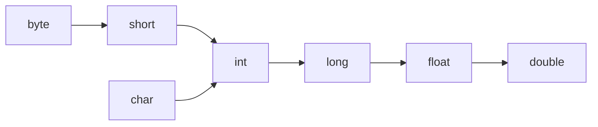

# Java学习之路——数据类型

## 一、数据类型分类


## 二、基本数据类型

| 数据类型 | 大小（单位：bit/位）                                   | 所属包装类            | 取值范围                      |
| -------- | ------------------------------------------------------ | --------------------- | ----------------------------- |
| byte     | 1 byte = 8 bit                                         | `java.lang.Byte`      | -128 ~ +127                   |
| short    | 2 byte = 16 bit                                        | `java.langShort`      | -32768 ~ +32767               |
| int      | 4 byte = 32 bit                                        | `java.lang.Integer`   | -2^31 ~ +2^31-1               |
| long     | 8 byte = 64 bit                                        | `java.lang.Long`      | -2^63 ~ +2^63-1               |
| float    | 4 byte = 32 bit                                        | `java.lang.Float`     | -3.4 * 10^38 ~ +3.4 * 10^38   |
| double   | 8 byte = 64 bit                                        | `java.lang.Double`    | -1.7 * 10^308 ~ +1.7 * 10^308 |
| char     | 2 byte = 16 bit                                        | `java.lang.Character` | 0 ~ 65535                     |
| boolean  | 4 byte = 32 bit (JVM 规范中 boolean 变量作为 int 处理) | `java.lang.Boolean`   | 只有"true"和"false"两个取值   |

	## 三、引用数据类型

### 1. 类（class）

类具备某些共同特征的实体的集合，它是一种抽象的数据类型，它是对所具有相同特征实体的抽象。

**注：**字符串实际上是一个类，因此字符串不属于基本数据类型！

实现：

```java
class Demo {}
```

### 2. 接口（interface）

接口就是一个规范，是某个事物对外提供的一些功能的说明。

实现：

```java
interface Demo {}
```

### 3. 数组（Array）

数组是用于储存多个相同类型数据的集合

实现：

```java
int[] array = {0,1,2};
```

## 四、类型转换

**八种基本数据类型，除了布尔型，其它类型之间都可以互相转换。**

### 1. 自动类型转换

Java 程序中，小容量的数据类型可以自动向大容量的数据类型转换。

转换顺序：



多种数据类型混合参与计算时，Java 程序会先将所有变量转换为最大的数据类型再进行运算。

例如：

```java
public class Demo {
    public static void main(String[] args) {
        byte a = 10;
        char b = 'A';  // Ascii码值为65
        int c = 100;

        System.out.println(a + b + c);  // 175
    }
}
```

在上面这个例子中，三种类型的数据进行加运算。由于在这三种类型中，int 类型为容量最大的类型，因此编译器会先将三种类型的数据转换为int类型的数据，再进行加法运算。因此输出的值为175。

### 2. 强制类型转换

将大容量的数据类型转换为小容量的数据类型的操作称为强制类型转换。

想要进行强制类型转换，需要加强制类型转换符程序才能编译通过。

从大容量的数字转换为小容量的数据类型，转换后的值可能会发生改变，因此需要谨慎使用！

```java
public class Demo {
    public static void main(String[] args) {
        double a = 10.1;
        int b;

        b = (int)a;
        System.out.println(b);  // 10
    }
}
```

将 double型数据转换为 int型数据，因为 int类型没有小数，因此转换过程中小数部分被丢弃。所有输出结果为10。

## 五、运算符

### 1. 算术运算符

| 操作符 | 描述                              |
| :----- | :-------------------------------- |
| +      | 加法 - 相加运算符两侧的值         |
| -      | 减法 - 左操作数减去右操作数       |
| *      | 乘法 - 相乘操作符两侧的值         |
| /      | 除法 - 左操作数除以右操作数       |
| ％     | 取余 - 左操作数除以右操作数的余数 |
| ++     | 自增: 操作数的值增加1             |
| --     | 自减: 操作数的值减少1             |

注：i++ 与 ++i 存在一定的区别：

- ++i 返回执行加一操作之后的值，i++ 返回执行加一操之前的值
- 若 i 是内置的数值类型，两者执行效率一样；若i是一些自定义的类 ++i 的效率 大于 i++的效率

### 2. 关系运算符

| 运算符 | 描述                                                         |
| :----- | :----------------------------------------------------------- |
| ==     | 检查如果两个操作数的值是否相等，如果相等则条件为真           |
| !=     | 检查如果两个操作数的值是否相等，如果值不相等则条件为真       |
| >      | 检查左操作数的值是否大于右操作数的值，如果是那么条件为真     |
| <      | 检查左操作数的值是否小于右操作数的值，如果是那么条件为真     |
| >=     | 检查左操作数的值是否大于或等于右操作数的值，如果是那么条件为真 |
| <=     | 检查左操作数的值是否小于或等于右操作数的值，如果是那么条件为真 |

### 3. 位运算符

| 操作符 | 描述                                                         |
| :----- | :----------------------------------------------------------- |
| ＆     | 如果相对应位都是1，则结果为1，否则为0                        |
| \|     | 如果相对应位都是 0，则结果为 0，否则为 1                     |
| ^      | 如果相对应位值相同，则结果为0，否则为1                       |
| 〜     | 按位取反运算符翻转操作数的每一位，即0变成1，1变成0           |
| <<     | 按位左移运算符。左操作数按位左移右操作数指定的位数           |
| >>     | 按位右移运算符。左操作数按位右移右操作数指定的位数           |
| >>>    | 按位右移补零操作符。左操作数的值按右操作数指定的位数右移，移动得到的空位以零填充 |

### 4. 逻辑运算符

| 操作符 | 描述                                                         |
| :----- | :----------------------------------------------------------- |
| &&     | 称为逻辑与运算符。当且仅当两个操作数都为真，条件才为真       |
| \| \|  | 称为逻辑或操作符。如果任何两个操作数任何一个为真，条件为真   |
| ！     | 称为逻辑非运算符。用来反转操作数的逻辑状态。如果条件为true，则逻辑非运算符将得到false |

### 5. 赋值运算符

| 操作符  | 描述                                                         |
| :------ | :----------------------------------------------------------- |
| =       | 简单的赋值运算符，将右操作数的值赋给左侧操作数               |
| + =     | 加和赋值操作符，它把左操作数和右操作数相加赋值给左操作数     |
| - =     | 减和赋值操作符，它把左操作数和右操作数相减赋值给左操作数     |
| * =     | 乘和赋值操作符，它把左操作数和右操作数相乘赋值给左操作数     |
| / =     | 除和赋值操作符，它把左操作数和右操作数相除赋值给左操作数     |
| （％）= | 取模和赋值操作符，它把左操作数和右操作数取模后赋值给左操作数 |
| << =    | 左移位赋值运算符                                             |
| >> =    | 右移位赋值运算符                                             |
| ＆=     | 按位与赋值运算符                                             |
| ^ =     | 按位异或赋值操作符                                           |
| \| =    | 按位或赋值操作符                                             |

### 6. 条件运算符

表达式：

```java
variable x = (expression) ? value if true : value if false
```

例子：

```java
public class Demo {
    public static void main(String[] args) {
        int a = 10, b;
        // 如果 a 等于 1 成立，则设置 b 为 20，否则为 30
        b = (a > 1) ? 20 : 30;
        System.out.println( "Value of b is : " +  b );  
        // Value of b is : 20
    }
}
```

### 7. instanceof  运算符

表达式：

```java
( Object reference variable ) instanceof  (class/interface type)
```

例子：

```java
public class Demo {
    public static void main(String[] args) {
        String name = "James";
        // 由于 name 是 String 类型，所以返回真
        System.out.println(name instanceof String);
        // true
    }
}
```

### 8. 运算符优先级

| 类别     | 操作符                                         | 关联性   |
| :------- | :--------------------------------------------- | :------- |
| 后缀     | () 、[]、 . (点操作符)                         | 左到右   |
| 一元     | expr++、expr--                                 | 从左到右 |
| 一元     | ++expr、--expr、+、-、～、！                   | 从右到左 |
| 乘性     | *、/、％                                       | 左到右   |
| 加性     | +、-                                           | 左到右   |
| 移位     | >>、>>> 、<<                                   | 左到右   |
| 关系     | >、>=、<、<=                                   | 左到右   |
| 相等     | ==、!=                                         | 左到右   |
| 按位与   | ＆                                             | 左到右   |
| 按位异或 | ^                                              | 左到右   |
| 按位或   | \|                                             | 左到右   |
| 逻辑与   | &&                                             | 左到右   |
| 逻辑或   | \| \|                                          | 左到右   |
| 条件     | ？：                                           | 从右到左 |
| 赋值     | =、+=、-=、*=、/=、％=、>>=、<<=、＆=、^=、\|= | 从右到左 |
| 逗号     | ，                                             | 左到右   |