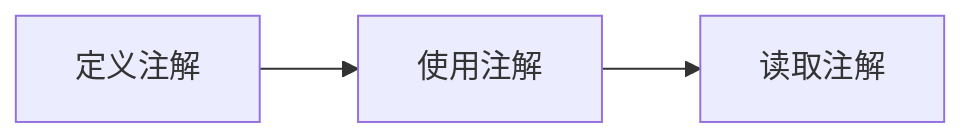

# Java学习之路——注解

## 概述

什么是注解（Annotation）？注解是放在Java源码的类、方法、字段、参数前的一种特殊“注释”。

注释会被编译器直接忽略，注解则可以被编译器打包进入class文件，因此，注解是一种用作标注的“元数据”。

像我们在重写父类方法时总会加上的 `@Override`，从形式上来说也是一种注解，只是实质上这个注解没干啥事罢了。

在 Java 程序中注解分为三类：

- 由编译器使用的注解；
- 由工具处理`.class`文件使用的注解；
- 在程序运行期能够读取的注解。

我们在定义一个注解时，还可以定义配置参数。配置参数可以包括：**基本类型、String、Class以及枚举的数组**。

注解的整个使用流程主要包括三个部分：



## 一、元注解

在 Java 中有一些注解可以修饰其他注解，这些注解就称为元注解（meta annotation）。

Java标准库已经定义了一些元注解，我们只需要使用元注解，通常不需要自己去编写元注解。

### @Target

最常用的元注解是`@Target`。使用`@Target`可以定义`Annotation`能够被应用于源码的哪些位置：

- 类或接口：`ElementType.TYPE`；
- 字段：`ElementType.FIELD`；
- 方法：`ElementType.METHOD`；
- 构造方法：`ElementType.CONSTRUCTOR`；
- 方法参数：`ElementType.PARAMETER`。
- 如果不传递参数，则所有地方都可以使用。

### @Retention

元注解`@Retention`定义了`Annotation`的生命周期：

- 仅编译期：`RetentionPolicy.SOURCE`；
- 仅 .class 文件：`RetentionPolicy.CLASS`；
- 运行期：`RetentionPolicy.RUNTIME`。

如果`@Retention`不存在，则该`Annotation`默认为`CLASS`。

一般情况下我们的注解都是需要利用反射进行处理的，因此我们通常情况下都要加上`RetentionPolicy.RUNTIME`。

### @Repeatable

`@Repeatable`元注解可以定义`Annotation`是否可重复。

### @Inherited

`@Inherited`元注解定义子类是否可继承父类定义的`Annotation`。

`@Inherited`仅针对`@Target(ElementType.TYPE)`类型的`annotation`有效，并且仅针对`class`的继承，对`interface`的继承是无效的。

## 二、定义注解

完整自定义一个注解分为三步：

### 1. 用`@interface`定义注解

```java
@interface MyAnnotation {
    
}
```

### 2. 添加参数和默认值

```java
@interface MyAnnotation {
    int min() default 0;
    int max() default 255;
}
```

默认值不是必须的，但是添加默认值是一个好习惯，能够为我们减少很多不必要的麻烦。

### 3. 使用元注解配置注解

```java
@Retention(RetentionPolicy.RUNTIME)
@interface MyAnnotation {
    int min() default 0;
    int max() default 255;
}
```

### 注解属性

- 八种基本数据类型；
- String；
- 枚举类；
- Class；
- 注解类型；
- 以上类型的一维数组。

`value`属性：如果注解的属性只有一个，并且叫 `value`，那么使用该注解时就可以不指定属性名，因为默认是给 `value` 进行赋值；如果注解的属性有多个，则必须写明属性的对应关系。

数组：如果注解属性中数组只有一个，那么可以省略 `{}`。

## 三、处理注解

在 Java 程序中，我们一般情况下都是利用反射的方式处理注解。

```java
import java.lang.annotation.*;
import java.lang.reflect.Field;
import java.lang.reflect.Method;

public class Demo {
    public static void main(String[] args) throws NoSuchFieldException, NoSuchMethodException {
        // 获取对类的注解
        Class<MyClass> clazz = MyClass.class;
        MyAnnotation annotationClass = clazz.getAnnotation(MyAnnotation.class);
        System.out.println(annotationClass);
		
        // 获取对类属性的注解
        Field count = clazz.getField("count");
        MyAnnotation annotationFiled = count.getAnnotation(MyAnnotation.class);
        System.out.println(annotationFiled);
		
        // 获取对方法的注解
        Method test = clazz.getMethod("test");
        MyAnnotation annotationMethod = test.getAnnotation(MyAnnotation.class);
        System.out.println(annotationMethod);
    }
}

@MyAnnotation(min = 1, max = 100)
class MyClass {
    @MyAnnotation(min = 5, max = 150)
    public int count=100;

    @MyAnnotation(min = 10, max = 200)
    public void test() {}
}

// 自定义注解
@Retention(RetentionPolicy.RUNTIME)
@interface MyAnnotation {
    int min() default 0;
    int max() default 255;
}
```

