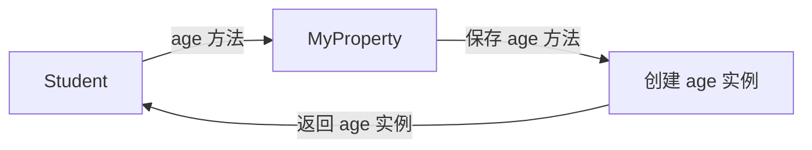

# Python学习之路 —— @property 原理剖析及实现

> 熟悉 Python 的朋友们都知道，Python 中有一个可以让方法像属性一样访问的 **@property** 装饰器，这个装饰器主要用来控制我们的属性。今天就带大家来解析这个装饰器。

## 分析功能

首先我们应该知道它实现了怎样的功能：

查看官方文档：

```python
"""
    Property attribute.
    
      fget
        function to be used for getting an attribute value
      fset
        function to be used for setting an attribute value
      fdel
        function to be used for del'ing an attribute
      doc
        docstring
    
    Typical use is to define a managed attribute x:
    
    class C(object):
        def getx(self): return self._x
        def setx(self, value): self._x = value
        def delx(self): del self._x
        x = property(getx, setx, delx, "I'm the 'x' property.")
    
    Decorators make defining new properties or modifying existing ones easy:
    
    class C(object):
        @property
        def x(self):
            "I am the 'x' property."
            return self._x
        @x.setter
        def x(self, value):
            self._x = value
        @x.deleter
        def x(self):
            del self._x
    """
```

## 实现

首先要明确的是，**property 是一个类装饰器！setter、getter、deleter都是这个类的方法！**

**实现代码：**

```python
class MyProperty(object):
    def __init__(self, fget=None, fset=None, fdel=None, doc=None):
        self.__fget = fget
        self.__fset = fset
        self.__fdel = fdel
        self.__doc__ = doc

    def __get__(self, instance, owner):
        return self.__fget(instance)

    def __set__(self, instance, value):
        # 判断是否设置了setter方法
        if self.__fset is None:
            raise AttributeError("this attribute is read-only")
        self.__fset(instance, value)

    def __delete__(self, instance):
        # 判断是否设置了deleter方法
        if self.__fdel is None:
            raise AttributeError("this attribute cannot delete")
        self.__fdel(instance)

    def getter(self, func):
		self.__fget = func
        return self

    def setter(self, func):
        self.__fset = func
        return self

    def deleter(self, func):
        self.__fdel = func
        return self
```

**示例代码：**

```python
class Student(object):
    def __init__(self):
        self.__age = 18

    @MyProperty
    def age(self):
        return self.__age

    @age.setter
    def age(self, value):
        self.__age = value

    @age.deleter
    def age(self):
        del self.__age


john = Student()
print(john.age)
john.age = 15
print(john.age)
del john.age
```

 **\_\_get、\_\_set______、\_\_delete__ 都是属性描述符的方法**

**初始化**

当我们初始化类时，被装饰的方法（age）传递给 MyProperty 描述符，实例会保存传递来的方法，并返回一个 MyProperty 的实例，实例的名字和方法名一样。



当我们调用 **john.age** 时，实际上调用的是 **MyProperty 的实例**，然后实例再调用初始化类时保存的方法，再将被调用的方法的返回值返回给 **john.age**，这样就达到了像调用属性一样调用方法的效果。

