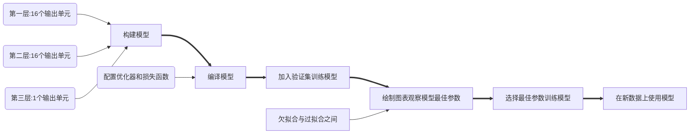

# 新闻分类：多分类问题

## 简介

> 本例出自《Python 深度学习》，自己做了一个简单的总结归纳。
>
> 完整代码请参考：[https://github.com/fchollet/deep-learning-with-python-notebooks](

### 数据预处理


### 训练模型



## 代码

### 加载数据集

注意：第一次运行会下载数据集，速度较慢。

```python
from keras.datasets import reuters

(train_data, train_label), (test_data, test_label) = reuters.load_data(num_words=10000)

```

### 将向量还原为原始新闻（非必须）

执行这一步只是为了更直观的了解别人是怎么处理数据的。

这里同样会下载数据。

```python
word_index = reuters.get_word_index()
reverse_word_index = dict([(value, key) for (key, value) in word_index.items()])
decoded_newswire = ' '.join([reverse_word_index.get(i-3, '?') for i in train_data[0]])
print(decoded_newswire)
```

### 将数据向量化

```python
import numpy as np

# 数据向量化
def vectorize_sequences(sequences, dimension=10000):
    results = np.zeros((len(sequences), dimension))
    for i, sequence in enumerate(sequences):
        results[i, sequence] = 1.
    return results

x_train = vectorize_sequences(train_data)
x_test = vectorize_sequences(test_data)
```

### 使用 one-hot 编码将标签向量化

```python
# one-hot编码方法实现
# def to_one_hot(labels, dimension=10000):
#     results = np.zeros((len(labels), dimension))
#     for i, label in enumerate(labels):
#         results[i, label] = 1.
#     return results

# 使用keras内置方法将标签向量化
from keras.utils.np_utils import to_categorical

one_hot_train_labels = to_categorical(train_label)
one_hot_test_labels = to_categorical(test_label)
```

### 构建模型

```python
# 定义模型
from keras import models
from keras import layers

model = models.Sequential()
"""
Q: 为什么此处输入单元数要使用64，为什么不使用电影评论分类时使用的16？
A：16维空间对于这个例子来说太小了，无法学会区分46个不同的类别。
   这种维度较小的层可能成为信息瓶颈，永久地丢失相关信息。
   如果是三分类，四分类问题你依然可以使用16个隐藏单元
Q：我能不能设置为640个单元？
A：单元数不是越大越好，网络容量越大，网络就越容易记住训练过的数据。
   网络会在训练过的数据上表现优异，但是在没有见过的数据上的表现则不容乐观。
   因此单元数不是越大越好，需要在欠拟合与过拟合之间找到一个平衡点。
"""
model.add(layers.Dense(64, activation='relu', input_shape=(10000, )))
model.add(layers.Dense(64, activation='relu'))
model.add(layers.Dense(46, activation='softmax'))

# 编译模型
model.compile(optimizer='rmsprop', loss='categorical_crossentropy', metrics=['accuracy'])
```

### 验证模型

```python
# 留出验证集
x_val = x_train[:1000]
partial_x_train = x_train[1000:]

y_val=one_hot_train_labels[:1000]
partial_y_train = one_hot_train_labels[1000:]

# 训练模型
history = model.fit(partial_x_train, partial_y_train, epochs=20, batch_size=512, validation_data=(x_val, y_val))
```

### 绘制训练情况图表

```python
# 绘制训练损失和验证损失
import matplotlib.pyplot as plt

loss = history.history['loss']
val_loss = history.history['val_loss']

epochs = range(1, len(loss)+1)

plt.plot(epochs, loss, 'bo', label='Training loss')
plt.plot(epochs, val_loss, 'b', label='Validation loss')

plt.title('Training and validation loss')
plt.xlabel('Epochs')
plt.ylabel('Loss')
plt.legend()


# 绘制训练精度和验证精度
plt.clf()

acc = history.history['accuracy']
val_acc = history.history['val_accuracy']

plt.plot(epochs, acc, 'bo', label='Training acc')
plt.plot(epochs, val_acc, 'b', label='Validation acc')
plt.title('Training and validation accuracy')
plt.xlabel('Epochs')
plt.ylabel('Accuracy')
plt.legend()

plt.show()
```


### 重新训练模型

观察图表，发现模型在第十轮附近出现过拟合现象。那么我们重新训练模型就训练九轮就行（可以尝试其它的）。

```python
# 重新训练模型
model = models.Sequential()
model.add(layers.Dense(64, activation='relu', input_shape=(10000, )))
model.add(layers.Dense(64, activation='relu'))
model.add(layers.Dense(46, activation='softmax'))

model.compile(optimizer='rmsprop', loss='categorical_crossentropy', metrics=['accuracy'])
history = model.fit(partial_x_train, partial_y_train, epochs=9, batch_size=512, validation_data=(x_val, y_val))
# 观察在测试集上表现
results = model.evaluate(x_test, one_hot_test_labels)
print(results)
# [0.9868815943054715, 0.7862867116928101]
# 80%左右的精度


# 采取随机预测的方式
import copy

test_labels_copy = copy.copy(test_label)
np.random.shuffle(test_labels_copy)
hits_array = np.array(test_label) == np.array(test_labels_copy)
print(float(np.sum(hits_array)) / len(test_label))
# 0.18788958147818344
# 20%的精度，可以看出模型的预测效果好得多
```

### 绘制图表观察重新训练的模型各项指标 -


## 小结

- 如果要对N个类别的数据点进行分类，**网络的最后一层应该是大小为N的Dense层**。
- 对于单标签、多分类问题，**网络的最后一层应该使用 softmax 激活**，这样可以输出在N个输出类别上的概率分布。
- 这种问题的损失函数几乎总是应该使用**分类交叉熵**。它将网络输出的概率分布与目标的真实分布之间的距离最小化。
- 如果你需要将数据划分到许多类别中，应该**避免使用太小的中间层**，以免在网络中造成信息瓶颈。
- 处理多分类问题的标签有两种方法。
  - 通过分类编码（也叫one-hot编码）对标签进行编码，然后使用categorical_crossentropy 作为损失函数。
  - 将标签编码为整数，然后使用 sparse_categorical_crossentropy 损失函数。