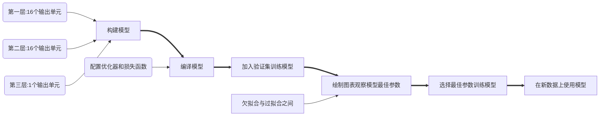

# 电影评论分类：二分类问题

## 简介

> 本例出自《Python 深度学习》，自己做了一个简单的总结归纳。
>
> 完整代码请参考：[https://github.com/fchollet/deep-learning-with-python-notebooks](https://github.com/fchollet/deep-learning-with-python-notebooks)

## 主要流程

### 数据预处理


### 训练模型



## 代码

### 加载数据集

注意：第一次加载会下载文件，速度较慢

```python
from keras.datasets import imdb

# 加载 IMDB 数据集
(train_data, train_labels), (test_data, test_labels) = imdb.load_data(num_words=10000)  # 取一万个词
```

### 整数序列转二进制矩阵

```python
import numpy as np

# 将整数序列编码为二进制矩阵
def vectorize_sequences(sequences, dimension=10000):
    print((len(sequences), dimension))
    results = np.zeros((len(sequences), dimension))
    for i, sequence in enumerate(sequences):
        results[i, sequence] = 1.
    return results

x_train = vectorize_sequences(train_data)
x_test = vectorize_sequences(test_data)
```

### 向量标签化

```python
# 标签向量化
y_train = np.asarray(train_labels).astype('float32')  # int64转float32
y_test = np.asarray(test_labels).astype('float32')
```

### 构建模型

```python
# 构建网络
from keras import layers
from keras import models

model = models.Sequential()
# 第一层，16个隐藏单元，激活函数为relu
model.add(layers.Dense(16, activation='relu', input_shape=(10000, )))
# 第二层，16个隐藏单元，激活函数为relu
model.add((layers.Dense(16, activation='relu')))
# 第三层，输出一个标量（预测结果），激活函数为sigmoid
model.add(layers.Dense(1, activation='sigmoid'))
```

### 编译模型

```python
# 编译模型
# 优化器：rmsprop
# 损失函数：binary_crossentropy（仅包含一个单元的模型可以采用，替代方案：mean_squared_error）
# 指标：精确
model.compile(optimizer='rmsprop', loss='binary_crossentropy', metrics=['accuracy'])
```

### 加入验证集训练模型

```python
# 留出验证集
x_val = x_train[:10000]
partial_x_train = x_train[10000:]

y_val = y_train[:10000]
partial_y_train = y_train[10000:]

# 训练模型
history = model.fit(partial_x_train, partial_y_train, epochs=20, batch_size=512, validation_data=(x_val, y_val))
```

### 绘制图表观察训练过程

```python
history_dict = history.history
# 绘制训练损失和验证损失
import matplotlib.pyplot as plt


loss = history.history['loss']
val_loss = history.history['val_loss']

epochs = range(1, len(loss) + 1)

plt.plot(epochs, loss, 'bo', label='Training loss')
plt.plot(epochs, val_loss, 'b', label='Validation')
plt.title('Training and validation loss')
plt.xlabel('Epochs')
plt.ylabel('Loss')
plt.legend()

plt.show()

# 绘制训练精度和验证精度
plt.clf()  # 清空图像

acc = history.history['accuracy']
val_acc = history.history['val_accuracy']

plt.plot(epochs, acc, 'bo', label='Training acc')
plt.plot(epochs, val_acc, 'b', label='Validation acc')
plt.title('Training and validation accuracy')
plt.xlabel('Epochs')
plt.ylabel('Accuracy')
plt.legend()

plt.show()
```


### 训练模型

```python
# 通过上面的图表发现模型在第四轮之后出现过拟合现象，因此我们选择训练轮数为4
model.fit(x_train, y_train, epochs=4, batch_size=512)
```

### 对新数据进行预测

```python
result = model.predict(x_test)
# [0.2930210903453827, 0.8831999897956848]
```

### 绘制图表

**训练损失和验证损失**

```python
# 绘制训练损失和验证损失
import matplotlib.pyplot as plt


loss = history.history['loss']
val_loss = history.history['val_loss']

epochs = range(1, len(loss) + 1)

plt.plot(epochs, loss, 'bo', label='Training loss')
plt.plot(epochs, val_loss, 'b', label='Validation')
plt.title('Training and validation loss')
plt.xlabel('Epochs')
plt.ylabel('Loss')
plt.legend()

plt.show()
```

**训练精度和验证精度**

```python
# 绘制训练精度和验证精度
plt.clf()  # 清空图像

acc = history.history['binary_accuracy']
val_acc = history.history['val_binary_accuracy']

plt.plot(epochs, acc, 'bo', label='Training acc')
plt.plot(epochs, val_acc, 'b', label='Validation acc')
plt.title('Training and validation accuracy')
plt.xlabel('Epochs')
plt.ylabel('Accuracy')
plt.legend()

plt.show()
```

## 总结

- 通常需要对原始数据进行大量预处理，以便将其转换为张量输入到神经网络中。单词序列可以编码为二进制向量，但也有其他编码方式。
- 带有`relu`激活的`Dense`层堆叠，可以解决很多种问题（包括情感分类），你可能会经常用到这种模型。
- 对于二分类问题（两个输出类别），网络的最后一层应该是只有一个单元并使用`sigmoid`激活的`Dense层`，网络输出应该是0~1范围内的标量，表示概率值。
- 对于二分类问题的`sigmoid`标量输出，你应该使用`binary_crossentropy`损失函数。
- 无论你的问题是什么，`rmsprop`优化器通常都是足够好的选择。这一点你无须担心。
- 随着神经网络在训练数据上的表现越来越好，模型最终会过拟合，并在前所未见的数据上得到越来越差的结果。一定要一直监控模型在训练集之外的数据上的性能。