# Noise 协议握手模式详解

## 一、Noise协议简介

Noise是一个基于 Diffie-Hellman（DH）密钥交换的加密协议框架，旨在提供一种灵活而安全的加密通信方式。Noise通过定义不同的握手模式（Handshake Patterns），来满足不同应用场景下的安全需求。这些模式决定了如何在两个参与方之间交换密钥以建立安全通信会话。

## 二、握手模式概述

Noise协议提供了一系列握手模式，每种模式都有其特定的用途和安全属性。以下是这些模式的简要概述：

### 1. 基本概念

在深入分析各个模式之前,我们需要理解一些基本概念:

- **静态密钥对(s)**: 长期使用的公私钥对
- **临时密钥对(e)**: 每次会话新生成的公私钥对
- **预共享密钥(psk)**: 双方提前约定的密钥
- **握手消息**: 用于建立安全通道的初始消息交换
- **传输数据**: 握手完成后的加密通信

### 2. **基本模式**

- **NN**：双方都没有静态密钥，仅使用临时密钥进行DH交换。
- **NK**：发起方没有静态密钥，但知道响应方的静态公钥，支持零RTT加密。
- **NX**：发起方没有静态密钥，响应方在握手过程中发送其静态公钥。
- **XN**：发起方在握手过程中发送其静态公钥，响应方没有静态密钥。
- **XK**：双方交换静态公钥，提供双向认证和零RTT加密。
- **XX**：双方在握手过程中交换静态公钥，提供双向认证。
- **KN**：响应方已知发起方的静态公钥，支持零RTT加密。
- **KK**：双方都已知对方的静态公钥，支持双向认证和零RTT加密。
- **KX**：发起方已知响应方的静态公钥，响应方在握手过程中发送其静态公钥。
- **IN**：发起方在第一次消息中立即发送其静态公钥，减少或没有身份隐藏。
- **IK**：发起方立即发送其静态公钥，响应方的静态公钥已知给发起方。
- **IX**：发起方立即发送其静态公钥，响应方在握手过程中发送其静态公钥。

### 3. **延迟模式**

- **NK1**、**XK1**、**XX1**等：这些模式在握手过程中推迟了认证DH操作的执行。

### 4. **预共享密钥（PSK）模式**

- **Npsk0**、**Kpsk0**、**Xpsk1**等：加入了预共享密钥（PSK），以增强安全性。

### 5. **其他模式**

- **Fallback模式**：允许在握手失败时回退到其他模式。

## 三、握手流程与适用场景分析

### 1. **NN模式**

**握手流程：**
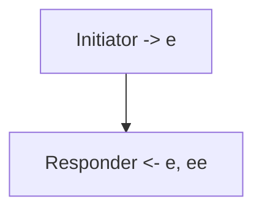

**适用场景**：
- **临时或匿名通信**：如在线聊天室、即时通讯应用中的临时会话。

**示例软件**：
- 一些即时通讯应用，如Signal的匿名模式。

**为什么选择NN模式**：
- 简单、快速，不需要任何身份认证，适合不需要长期通信的场景。

### 2. **NK模式**

**握手流程：**
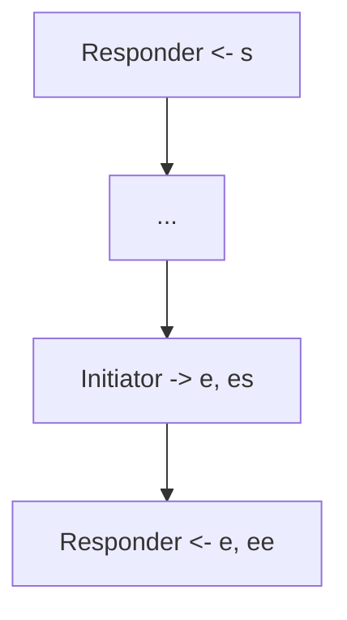

**适用场景**：
- **零RTT加密**：如VPN客户端连接到已知服务器。

**示例软件**：
- VPN软件，如OpenVPN或WireGuard。

**为什么选择NK模式**：
- 提供零RTT加密，适合需要立即加密数据的场景。

### 3. **NX模式**

**握手流程：**
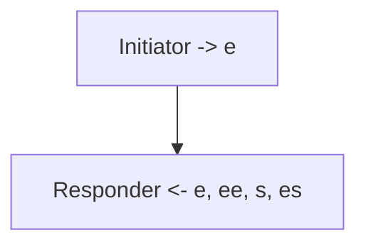

**适用场景**：
- **客户端到服务器连接**：如在线服务的客户端需要验证服务器身份。

**示例软件**：
- 在线游戏客户端连接到服务器。

**为什么选择NX模式**：
- 提供响应方认证，适合需要验证服务端身份但不提供零RTT加密的场景。

### 4. **XN模式**

**握手流程：**
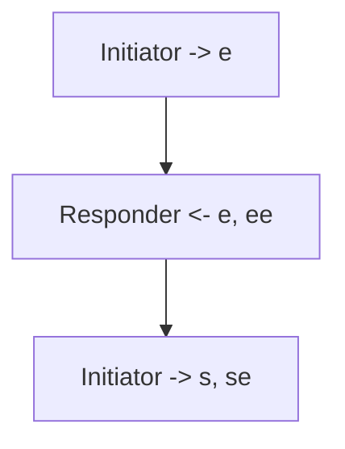

**适用场景**：
- **客户端认证**：如客户端需要向服务器证明自己的身份。

**示例软件**：
- 云存储客户端认证。

**为什么选择XN模式**：
- 提供发起方认证，适用于需要客户端认证的场景。

### 5. **XK模式**

**握手流程：**
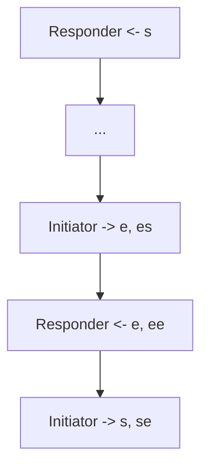

**适用场景**：
- **双向认证和零RTT加密**：如安全的客户端-服务器通信。

**示例软件**：
- 安全的邮件客户端或云服务。

**为什么选择XK模式**：
- 提供双向认证和零RTT加密，适合需要高安全性和立即加密通信的场景。

### 6. **XX模式**

**握手流程：**
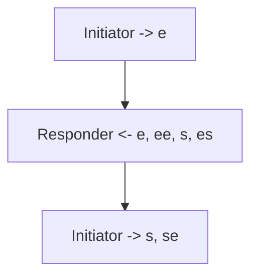

**适用场景**：
- **双向认证**：如VPN连接、安全的P2P通信。

**示例软件**：
- VPN软件如WireGuard。

**为什么选择XX模式**：
- 提供双向认证，适用于需要双方都验证身份的场景。

### 7. **KN模式**

**握手流程：**
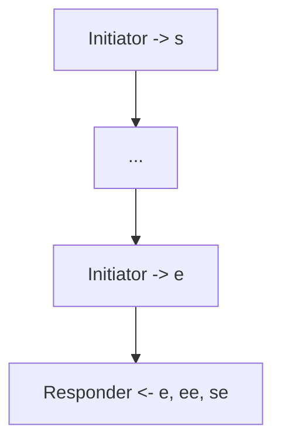

**适用场景**：
- **零RTT加密**：如服务器主动联系已知的客户端。

**示例软件**：
- 企业内部的自动更新服务。

**为什么选择KN模式**：
- 提供零RTT加密，适合需要立即加密通信的场景。

### 8. **KK模式**

**握手流程：**
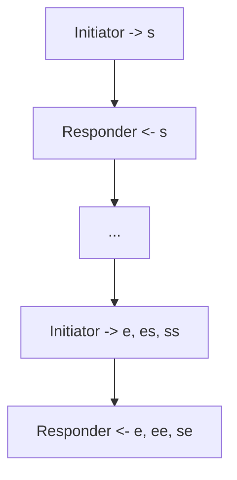

**适用场景**：
- **高安全性需求**：如企业内网通信。

**示例软件**：
- 企业级VPN或安全通信软件。

**为什么选择KK模式**：
- 提供双向认证和零RTT加密，适合需要极高安全性的场景。

### 9. **KX模式**

**握手流程：**
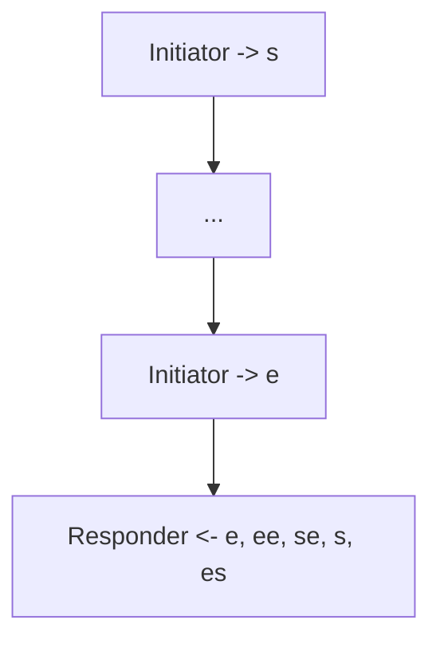

**适用场景**：
- **安全的客户端-服务器通信**：如需要双向认证的在线服务。

**示例软件**：
- 安全的云存储服务。

**为什么选择KX模式**：
- 提供双向认证，适合需要验证双方身份的场景。

### 10. **IN模式**

**握手流程：**
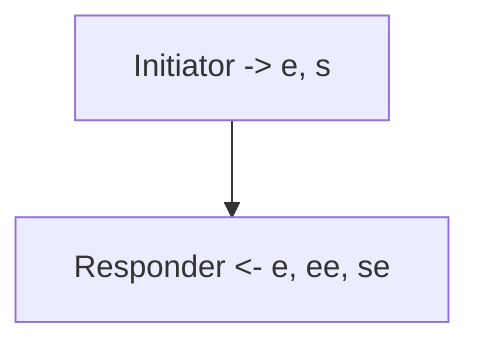

**适用场景**：
- **客户端主动认证**：如客户端需要立即验证身份。

**示例软件**：
- 在线支付或银行客户端。

**为什么选择IN模式**：
- 提供发起方立即认证，适用于需要立即验证身份的场景。

### 11. **IK模式**

**握手流程：**
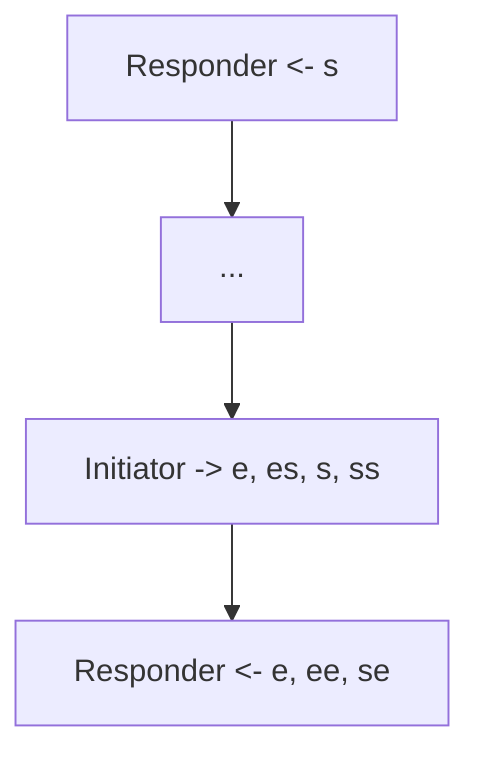

**适用场景**：
- **双向认证**：如VPN连接。

**示例软件**：
- VPN软件如OpenVPN。

**为什么选择IK模式**：
- 提供双向认证和零RTT加密，适合需要立即验证身份和加密通信的场景。

### 12. **IX模式**

**握手流程：**
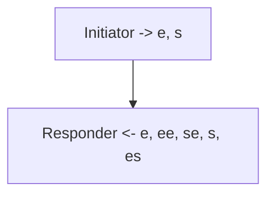

**适用场景**：
- **双向认证**：如高安全性需求的P2P通信。

**示例软件**：
- 安全的P2P文件共享软件。

**为什么选择IX模式**：
- 提供双向认证，适用于需要双方立即验证身份的场景。

## 四、延迟模式与PSK模式

### 1. **延迟模式**

延迟模式（如NK1、XK1、XX1等）推迟了认证操作，提供更好的身份隐藏和灵活性。

**适用场景**：
- **身份隐藏**：如在某些情况下需要更好的身份隐藏或更灵活的认证方式。

**示例软件**：
- 需要高匿名性的通信软件。

**为什么选择延迟模式**：
- 提供更好的身份隐藏和认证灵活性，适合需要保护参与方身份的场景。

### 2. **PSK模式**

预共享密钥（PSK）模式（如Npsk0、Kpsk0、Xpsk1等）引入了预共享密钥，以增强安全性。

**适用场景**：
- **额外安全层**：如IoT设备通信、企业内部网络通信。

**示例软件**：
- 智能家居设备的通信协议。

**为什么选择PSK模式**：
- 使用预共享密钥增强安全性，适用于需要额外安全层或预共享密钥的场景。

## 五、总结

Noise协议通过提供多种握手模式，满足了不同应用场景下的安全需求：

- **基本模式**：如NN、NK、NX等，适用于基本的加密需求。
- **延迟模式**：如NK1、XK1等，提供更好的身份隐藏和灵活性。
- **PSK模式**：如Npsk0、Kpsk0等，适用于需要预共享密钥增强安全性的场景。

选择合适的握手模式需要考虑认证需求、前向安全性需求、是否需要零RTT加密，以及是否需要使用预共享密钥等因素。每个模式都为不同的使用场景提供了特定的安全属性和通信方式，确保了通信的安全性和效率。通过本报告的分析，第一次接触Noise的人可以更好地理解这些模式的应用场景和选择依据。